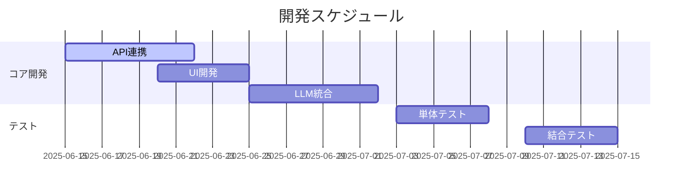

# 開発計画書

## 1. 開発フェーズ

## 2. タスク分解
### 第1週 (2025/06/15-06/21)
- [ ] Yahoo Finance API連携
- [ ] データ取得モジュール実装
- [ ] 基本UIプロトタイプ

### 第2週 (2025/06/22-06/28)
- [ ] LLM統合基本実装
- [ ] 分析エンジンコア開発
- [ ] UI改善

## 3. リソース計画
- 開発環境: VSCode, Python 3.10
- テスト環境: ローカルマシン
- 必要なスキル:
  - Pythonプログラミング
  - API連携経験
  - LLM活用知識

## 4. リスク管理
- Yahoo Finance API制限
- LLM推論精度問題
- UIレスポンス遅延
