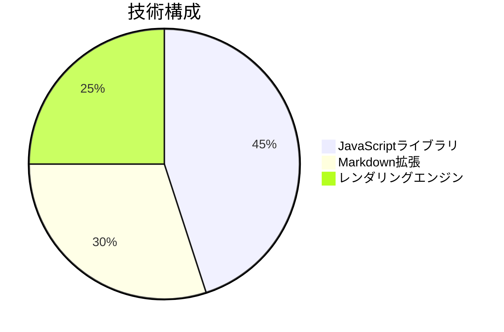

# Mermaid図の表示技術と使用方法

## 1. Mermaid図の技術基盤


### 主要技術要素
- **Mermaid.js**: 図をレンダリングするJavaScriptライブラリ
- **Markdownプレビュー拡張**: 図を可視化するVSCode機能
- **SVG生成**: 図形をベクターグラフィックスで描画

## 2. VSCodeでの設定方法

### 必要な拡張機能
1. "Markdown All in One" (必須)
2. "Mermaid Preview" (推奨)

### 設定手順
```bash
# VSCode拡張機能のインストール
code --install-extension yzhang.markdown-all-in-one
code --install-extension vstirbu.vscode-mermaid-preview
```

### 使用方法
1. `.md`ファイルにMermaidコードブロックを記述
2. 右クリック → "Open Preview" を選択
3. 図が自動レンダリングされます

## 3. サンプル図の種類


## 4. トラブルシューティング
- 図が表示されない場合:
  - 拡張機能を再読み込み
  - VSCodeを再起動
  - Mermaid構文を確認
