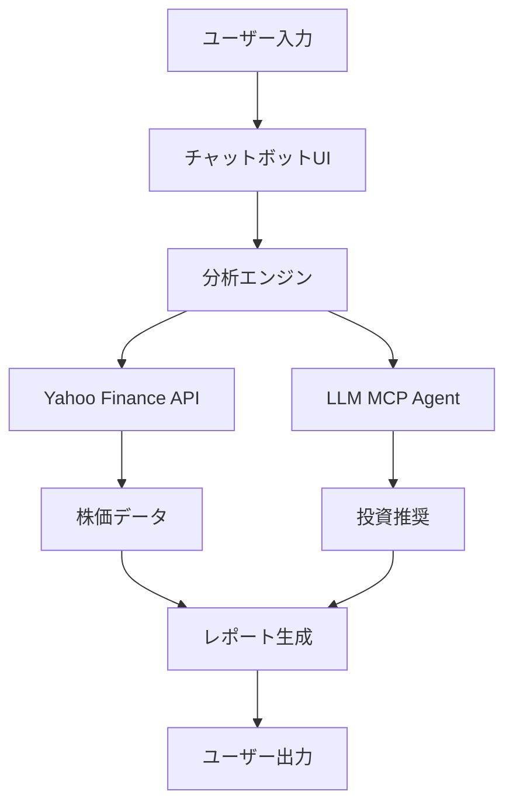

# プロジェクト概要ドキュメント

## 1. プロジェクト基本情報
- プロジェクト名: 株投資アシスタント
- 目的: 個人投資家向けAI支援ツールの開発
- 主要機能:
  - Yahoo Financeデータ連携
  - LLMによる分析・推奨
  - チャットボットUI

## 2. システムアーキテクチャ

## 3. 技術スタック
- フロントエンド: Streamlit
- バックエンド: Python
- 主要ライブラリ:
  - yfinance
  - LangChain
  - pandas

## 4. 開発ロードマップ
1. Yahoo Finance API連携
2. チャットボットUIプロトタイプ
3. LLM統合実装
4. テスト & デバッグ
5. リリース準備
