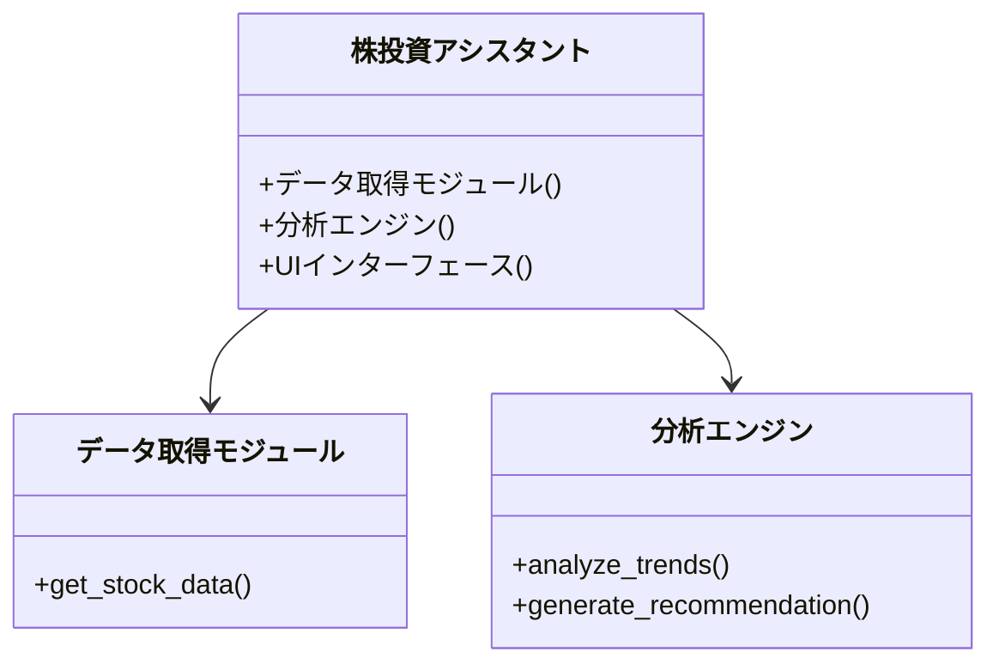
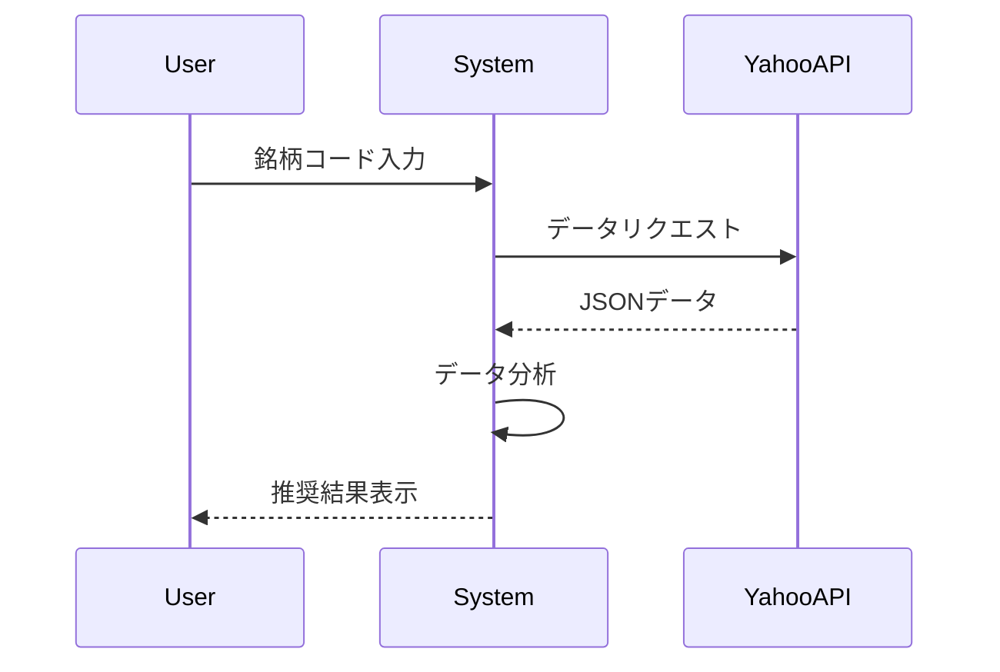

# 技術設計書

## 1. システム構成

## 2. 主要モジュール仕様
### データ取得モジュール
- Yahoo Finance APIを使用
- 取得データ:
  - 株価(日次/週次)
  - 財務諸表
  - 企業情報

### 分析エンジン
- LLMを使用した自然言語処理
- 技術指標計算:
  - RSI
  - 移動平均
  - ボリンジャーバンド

## 3. API仕様

## 4. データモデル
- 銘柄マスタ
- 株価データ
- ユーザープロファイル
