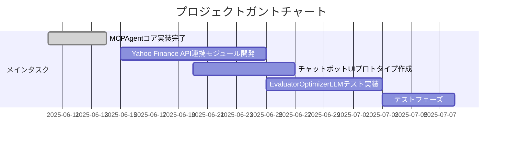

# プロジェクト進捗

## 現在の状態
[プロジェクトの全体的な進捗状況]

## 完了済み項目
- MCPAgentコア実装:
  - optimizer/evaluatorエージェント初期化
  - evaluator_optimizer_callメソッド実装
  - テスト用エントリーポイント追加
- 環境変数管理システム (.env + config.yaml)
- richライブラリによるロギング統合
- テストモード基本実装

## 未完了項目
[まだ完了していない重要な項目]

## 既知の問題
[現在把握している問題やバグ]

## 進化の軌跡
[プロジェクトの方向性や設計の変化]
