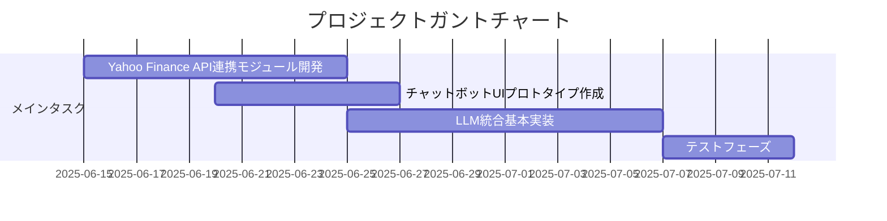

# プロジェクト進捗

```mermaid
gantt
    title プロジェクトガントチャート
    dateFormat  YYYY-MM-DD
    section メインタスク
    Yahoo Finance API連携モジュール開発     :a1, 2025-06-15, 10d
    チャットボットUIプロトタイプ作成        :a2, 2025-06-20, 7d
    LLM統合基本実装                         :a3, after a1, 12d
    テストフェーズ                          :a4, after a3, 5d
```

## 現在の状態
[プロジェクトの全体的な進捗状況]

## 完了済み項目
[これまでに完了した主要な機能やタスク]

## 未完了項目
[まだ完了していない重要な項目]

## 既知の問題
[現在把握している問題やバグ]

## 進化の軌跡
[プロジェクトの方向性や設計の変化]
