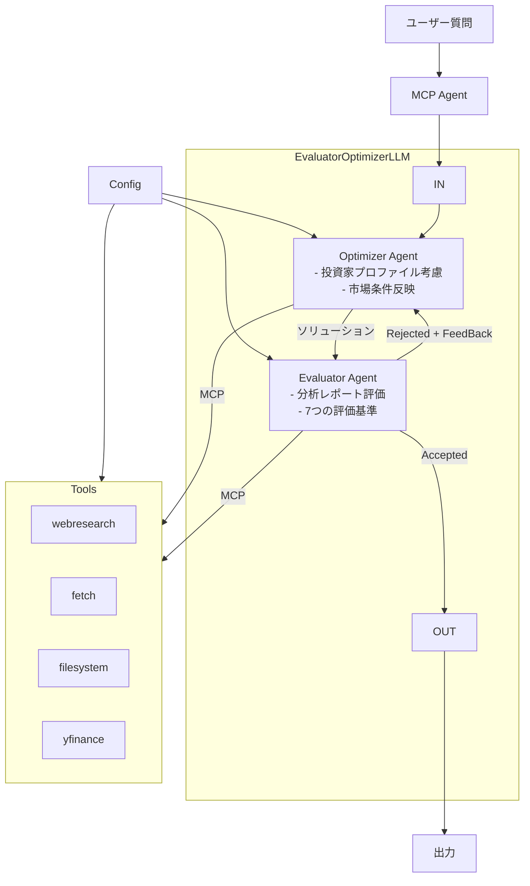

# システムパターン

## アーキテクチャ概要

## 主要コンポーネント
1. **MCPAgentコア**
   - エージェント管理 (optimizer/evaluator)
   - 処理フロー制御
   - 環境変数/設定管理
2. **Optimizer Agent**
   - 株式スクリーニング専門
   - 投資家プロファイルに基づく最適化
3. **Evaluator Agent**
   - 分析レポート評価
   - 7つの評価基準適用
4. **EvaluatorOptimizerLLM**
   - 品質評価ループ管理
   - OpenAIAugmentedLLM統合
5. **チャットボットUI** (Streamlit)
   - ユーザーインタラクション管理
   - クエリ入力/結果表示

## 設計パターン
- **モジュラー設計**: 各コンポーネントを独立して開発・テスト可能
- **MVCパターン**: UI/ロジック/データの分離
- **堅牢なエラーハンドリング**: 設定ファイル読み込み時の詳細なエラー処理
- **テスト容易性**: 環境変数によるモックレスポンス切り替え

## 統合ポイント
- **Yahoo Finance API**: RESTful API経由のデータ取得
- **Google News API**: 業界ニュース取得（無料枠）
- **Reuters RSS**: 業界ニュース取得（無料）
- **LLM MCP Agent**: 自然言語処理と推論エンジン連携
- **設定管理**: config.yamlからの認証情報取得
