# システムパターン

## アーキテクチャ概要

```mermaid
graph TD
    A[ユーザー質問] --> B[MCP Agent]
    B --> C{処理タイプ}
    C -->|データ取得| D[Yahoo Finance API]
    C -->|ニュース取得| N[ニュースソース]
    C -->|分析| E[deeseek reasoner]
    E --> EV[Evaluator: deeseek reasoner]
    EV -->|フィードバック| OP[Optimizer: deeseek reasoner]
    OP -->|パラメータ調整| E
    EV -->|合格| F[deepseek chat]
    F --> I[PDFレポート]
    D --> G[株価/財務データ]
    N --> K[業界ニュース]
    G & K --> B
    B --> J[回答出力]
    L[Config] --> D
    L --> N
    L --> EV[Evaluator]
    L --> OP[Optimizer]
```

## 主要コンポーネント
1. **チャットボットUI** (Streamlit)
   - ユーザーインタラクション管理
   - クエリ入力/結果表示
2. **分析エンジン** (Pythonコア)
   - データ解析
   - 推奨生成ロジック
3. **レポート生成モジュール**
   - Markdown/PDF出力

## データフロー
1. ユーザークエリ入力
2. 銘柄コード抽出
3. 設定ファイルから認証情報取得
4. Yahoo Financeから金融データ取得
5. ニュースソースから業界情報取得
6. LLM分析実行
7. Evaluatorによる結果評価
   - スコア＜0.6の場合: Optimizerがパラメータ調整
8. 結果をレポート形式で生成
9. ユーザーに出力

## 設計パターン
- **モジュラー設計**: 各コンポーネントを独立して開発・テスト可能
- **MVCパターン**: UI/ロジック/データの分離

## 統合ポイント
- **Yahoo Finance API**: RESTful API経由のデータ取得
- **Google News API**: 業界ニュース取得（無料枠）
- **Reuters RSS**: 業界ニュース取得（無料）
- **LLM MCP Agent**: 自然言語処理と推論エンジン連携
- **設定管理**: config.yamlからの認証情報取得
